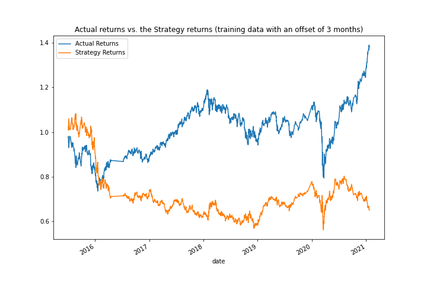
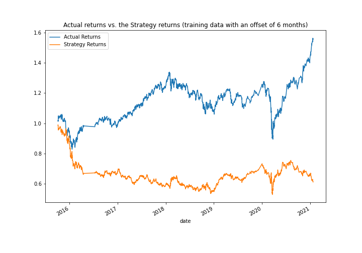
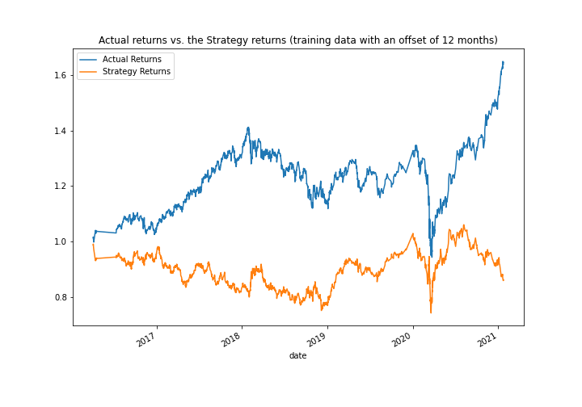
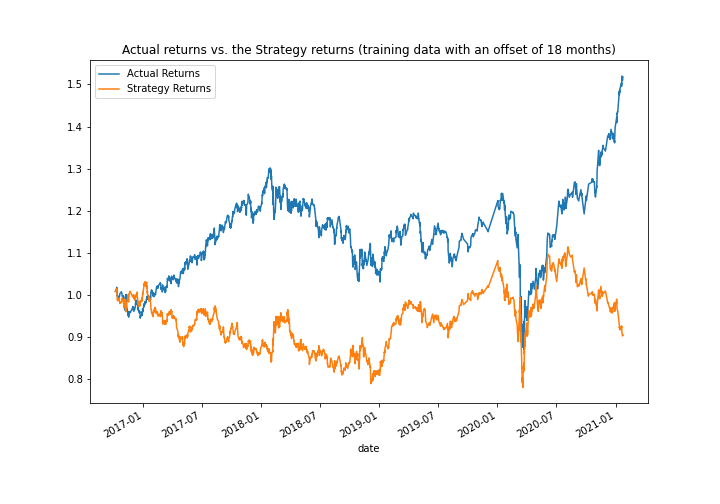
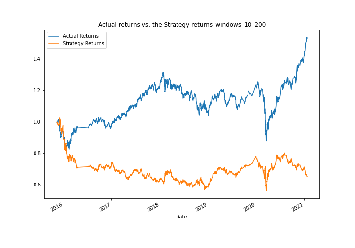
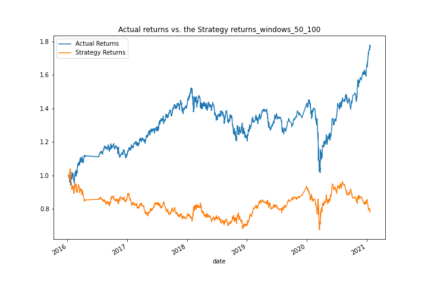
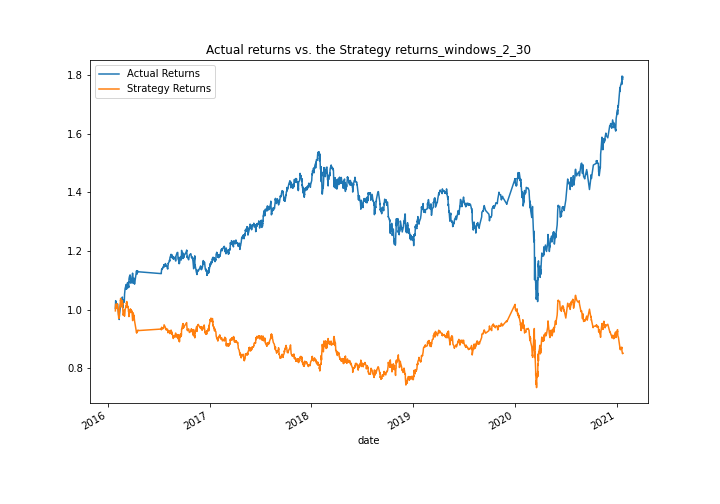
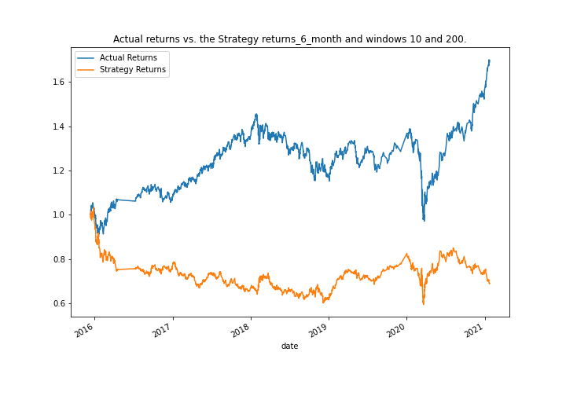
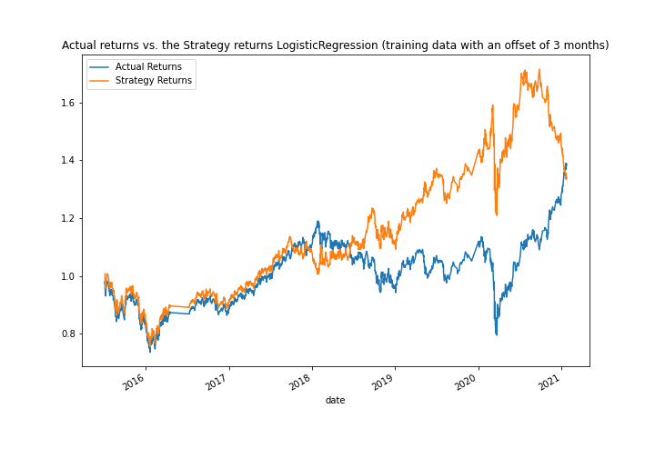

# Machine-Learning-Trading-Bot

This repository represents algorithmic trading bot that learns and adapts to new data and evolving markets.

---

## Approach

Step 1: Implement an algorithmic trading strategy that uses machine learning to automate the trade decisions.

Step 2: Adjust the input parameters to optimize the trading algorithm.

Step 3: Train a new machine learning model and compare its performance to that of a baseline model.

---

## Technologies

This project leverages the following tools for financial analysis:

- [Conda](https://docs.conda.io/en/latest/) - source package management system and environment management system.

- [Pandas](https://pandas.pydata.org) - Python library that’s designed specifically for data analysis.

- [NumPy](https://numpy.org) - to perform a wide variety of mathematical operations on arrays.

- [hvPlot](https://hvplot.holoviz.org) - the static plotting API.

- [Matplotlib](https://matplotlib.org) - is a comprehensive library for creating static, animated, and interactive visualizations.

- [scikit-learn](https://scikit-learn.org/stable/) - Simple and efficient tools for predictive data analysis.

---

## Input data

`/Resources/emerging_markets_ohlcv.csv` - file contains OLHCV data for asset.

---

## Output data

`/Images` - contains plots of Actual returns vs Strategy returns.

---

## Establish a Baseline Performance

### The classification report associated with the SVC model predictions.

```
              precision    recall  f1-score   support

        -1.0       0.43      0.04      0.07      1804
         1.0       0.56      0.96      0.71      2288

    accuracy                           0.55      4092
   macro avg       0.49      0.50      0.39      4092
weighted avg       0.50      0.55      0.43      4092
```



The precision is 0.43 for the −1 class and 0.56 for the 1 class. The recall is 0.04 for the −1 class and 0.96 for the 1 class. Based on the higher recall, it seems that the model is better at predicting the 1 class than the −1 class.

## Tune the Baseline Trading Algorithm

### Tune the training algorithm by adjusting the size of the training dataset

**DateOffset(months=6)**

```
              precision    recall  f1-score   support

        -1.0       0.44      0.02      0.04      1732
         1.0       0.56      0.98      0.71      2211

    accuracy                           0.56      3943
   macro avg       0.50      0.50      0.38      3943
weighted avg       0.51      0.56      0.42      3943
```



**DateOffset(months=12)**

```
              precision    recall  f1-score   support

        -1.0       0.00      0.00      0.00      1497
         1.0       0.56      1.00      0.72      1931

    accuracy                           0.56      3428
   macro avg       0.28      0.50      0.36      3428
weighted avg       0.32      0.56      0.41      3428
```



**DateOffset(months=18)**

```
              precision    recall  f1-score   support

        -1.0       0.75      0.00      0.00      1430
         1.0       0.56      1.00      0.72      1843

    accuracy                           0.56      3273
   macro avg       0.66      0.50      0.36      3273
weighted avg       0.64      0.56      0.41      3273
```



Adjusting of DateOfSet doesn't help much to improve model effectivecy. But we can say that recal and precision much better if we yo use not a long DateOfSet number (for example 6 month looks much better than 12 or 18 months).

### Tune the trading algorithm by adjusting the SMA input features

**short_window = 10, long_window = 200**

```
              precision    recall  f1-score   support

        -1.0       0.00      0.00      0.00      1694
         1.0       0.56      1.00      0.72      2161

    accuracy                           0.56      3855
   macro avg       0.28      0.50      0.36      3855
weighted avg       0.31      0.56      0.40      3855
```



**short_window = 50, long_window = 100**

```
              precision    recall  f1-score   support

        -1.0       0.44      0.88      0.59      1598
         1.0       0.59      0.13      0.21      2075

    accuracy                           0.46      3673
   macro avg       0.51      0.51      0.40      3673
weighted avg       0.52      0.46      0.38      3673
```



**short_window = 2, long_window = 30**

```
              precision    recall  f1-score   support

        -1.0       0.43      1.00      0.61      1554
         1.0       0.80      0.01      0.01      2027

    accuracy                           0.44      3581
   macro avg       0.62      0.50      0.31      3581
weighted avg       0.64      0.44      0.27      3581
```



The SMA inputs **short_window = 10, long_window = 200** helps to improve model efficienty, but not much. We can see improvement only at the beginning of the charts.

### Choose the set of parameters that best improved the trading algorithm returns

**short_window = 10, long_window = 200**
**DateOffset(months=6)**

```
              precision    recall  f1-score   support

        -1.0       0.43      0.19      0.27      1651
         1.0       0.56      0.81      0.66      2120

    accuracy                           0.54      3771
   macro avg       0.50      0.50      0.46      3771
weighted avg       0.51      0.54      0.49      3771
```



Using both best helps to improve the model efficienty, but not much.
The precision is 0.43 for the −1 class and 0.56 for the 1 class. The recall is 0.19 for the −1 class and 0.81 for the 1 class. Based on the higher recall, it seems that the model is better at predicting the 1 class than the −1 class.

## Evaluate a New Machine Learning Classifier (classifier "LogisticRegression")

```
              precision    recall  f1-score   support

        -1.0       0.44      0.33      0.38      1804
         1.0       0.56      0.66      0.61      2288

    accuracy                           0.52      4092
   macro avg       0.50      0.50      0.49      4092
weighted avg       0.51      0.52      0.51      4092
```



We can definitely say that using Logistic Regression classifier significantly improves model efficiently.  
The precision is 0.44 for the −1 class and 0.56 for the 1 class. The recall is 0.33 for the −1 class and 0.66 for the 1 class. Based on the higher recall, it seems that the model is better at predicting the 1 class than the −1 class. But looks like results are more balanced, so prediction is much better instead of using SVC model prediction.

---

## Contributors

Vladislav Glupak - [Linkedin](https://www.linkedin.com/in/vladislav-glupak/)

---

## License

It is an Open-source analysis.
